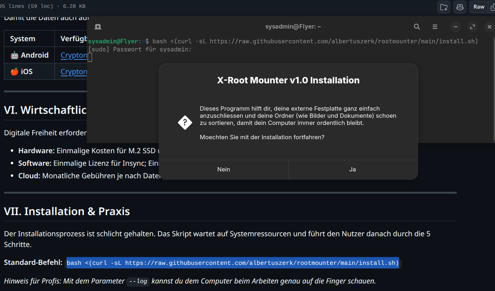
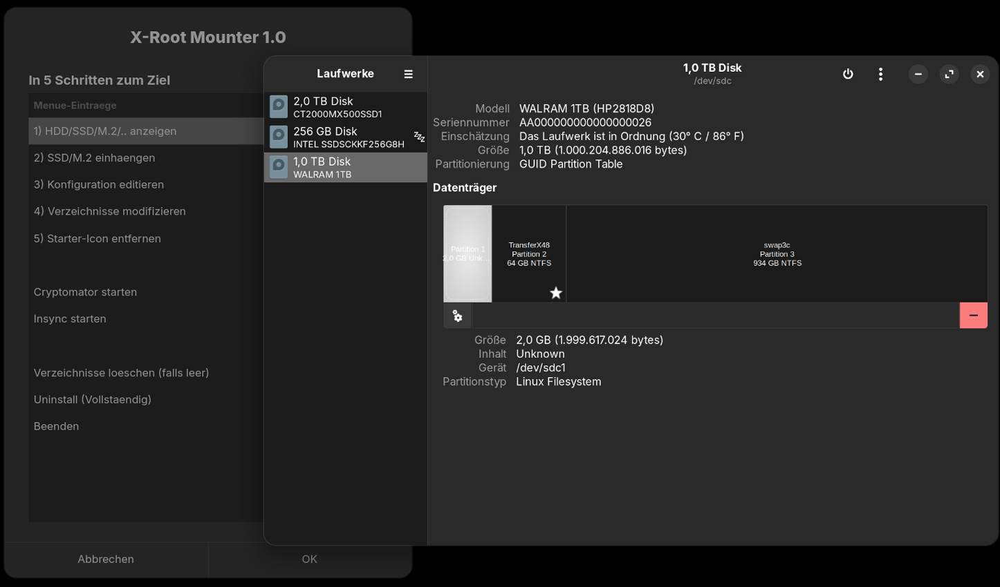
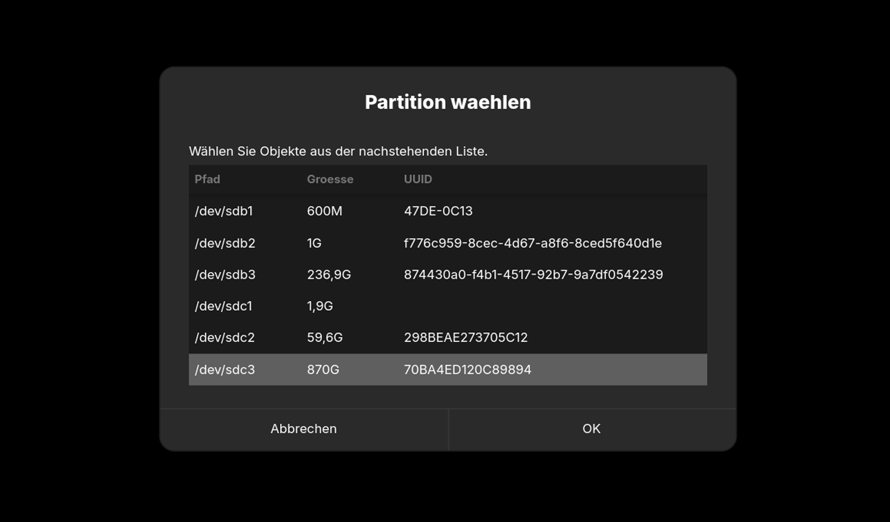
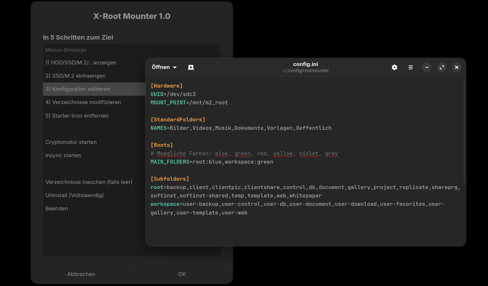
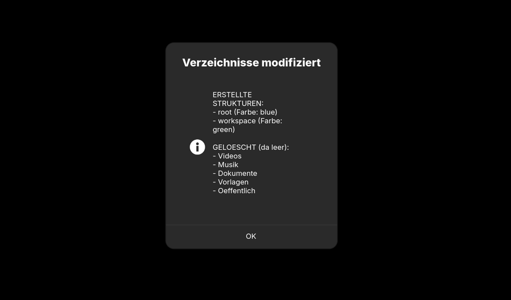
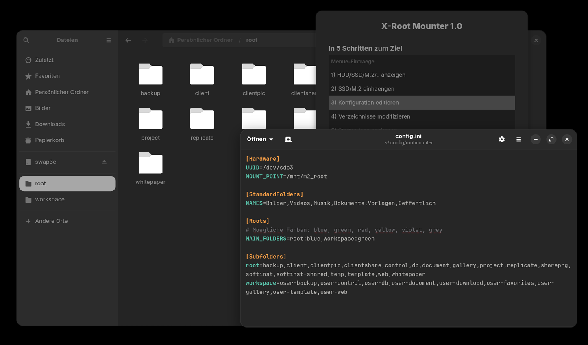
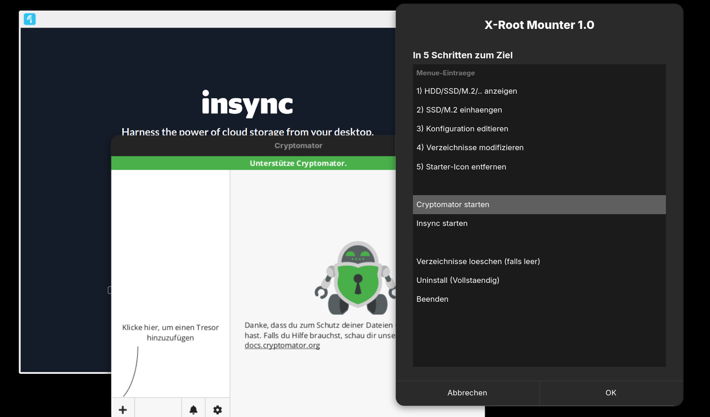
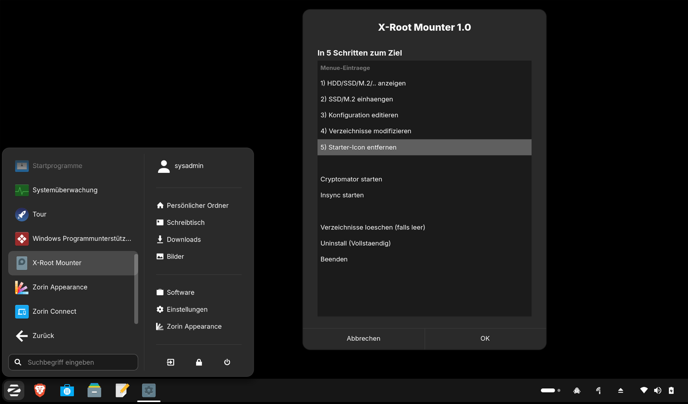
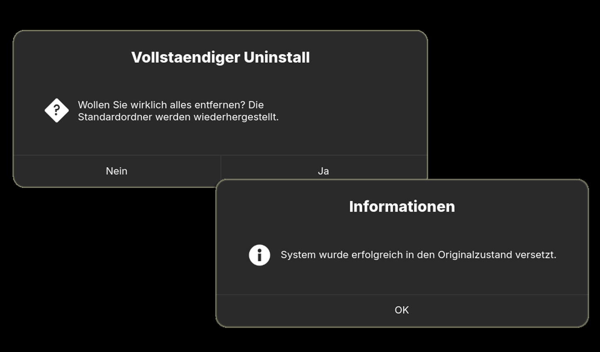

<p align="center">
  
</p>

# Whitepaper: X-Root Mounter v1.0

### Konzept für digitale Souveränität und Hardware-Autonomie

---

## I. Das pädagogische Leitbild: Daten als Vermächtnis

In der heutigen E-Learning-Landschaft wird Medienkompetenz oft auf die reine Nutzung von Software reduziert. Wir verfolgen einen tieferen, philosophischen Ansatz: Die Erziehung zur digitalen Selbstbestimmung.

### 1. Die SSD als physischer Anker
Ein Laptop ist ein flüchtiges Werkzeug. Er wird ersetzt, geht kaputt oder wird gegen ein neueres Modell getauscht. Werden Daten nur intern gespeichert, bleibt das Bewusstsein für deren Wert oft abstrakt und gering.
* **Die Visualisierung des Fleisses:** Da die meisten Laptops keinen internen Platz für eine zweite Festplatte bieten, wird die SSD beim X-Root-Konzept oft physisch auf das Gehäuse geklebt. 
* **Pädagogischer Effekt:** Diese "aufgeklebte" Disk ist für Kinder und Jugendliche ständig sichtbar. Sie ist kein verstecktes Bauteil, sondern ein greifbarer Gegenstand, zu dem man Sorge tragen muss. Es ist der "digitale Koffer", der das eigene Werk (Bilder, Dokumente, Projekte) enthält.

### 2. Mobilität des Geistes
Die Lernenden begreifen: *"Mein Wissen und mein Werk hängen nicht an diesem einen Laptop."* Bei einem Gerätewechsel wird die Disk einfach abgezogen und am neuen System angesteckt. Die gewohnte Struktur bleibt sofort erhalten. Das schafft eine enorme Unabhängigkeit gegenüber Hardware-Zyklen.

---

## II. Die technische Symbiose: YubicoSysLock & X-Root Mounter

In diesem System arbeiten zwei spezialisierte Partner zusammen. Während der Mounter die Ordnung schafft, sorgt die Hardware-Sicherung für den absoluten Schutz.

### 1. [YubicoSysLock](https://github.com/albertuszerk/yubicosyslock): Der digitale Zauberschlüssel (YubiKey)
Stell dir vor, du hast eine Schatzkiste, in der all deine Geheimnisse und deine Arbeit liegen. Ein Passwort ist wie ein geheimes Wort, das man flüstert – aber jemand könnte lauschen und es stehlen. Ein **YubiKey** hingegen ist ein echter, physischer Schlüssel, den du in der Hand halten kannst.

* **Der Türsteher für den Laptop:** Ohne dass dieser Schlüssel im Gerät steckt, bleibt der Laptop schlafend. Er lässt niemanden herein, der den echten Schlüssel nicht bei sich trägt.
* **Der Bodyguard für das Internet:** Ein YubiKey kann aber noch viel mehr. Er beschützt dich auch ausserhalb deines Laptops. Ob bei deiner E-Mail, bei Instagram, TikTok oder YouTube: Du kannst ihn so einstellen, dass man sich dort nur anmelden kann, wenn man den Schlüssel kurz antippt.
* **Passwörter vergessen erlaubt:** Das Beste für Kinder ist: Mit diesem Schlüssel muss man sich nicht mehr hunderte komplizierte Passwörter merken. Der Schlüssel beweist dem Computer, dass du es wirklich bist. Es ist, als hättest du einen digitalen Fingerabdruck in der Tasche, der niemals lügt.
* **Sicherheit zum Anfassen:** Kinder lernen so, dass Sicherheit nichts Abstraktes ist, sondern etwas, das man anfassen und für das man Verantwortung übernehmen kann (wie für einen Hausschlüssel).

### 2. [X-Root Mounter](https://github.com/albertuszerk/rootmounter): Der schlaue Architekt
Während der YubiKey die "Haustür" bewacht, sorgt der X-Root Mounter dafür, dass deine "Möbel" (deine Daten) mobil bleiben. Er schiebt deine Verzeichnisse auf die externe SSD, damit sie nicht im Laptop gefangen sind.

**Die Kombination:** Ein System, das nur mit deinem persönlichen Zauberschlüssel (YubiKey) startet, und Daten, die sicher auf deiner mobilen Schatzkiste (SSD) liegen. Beides zusammen macht dich zum absoluten Chef über deine digitale Welt.

---

## III. Die Strategie: Multi-Cloud & Verschlüsselung

Souveränität bedeutet auch, die Cloud zu nutzen, ohne sich ihr auszuliefern. Wir nutzen die Cloud lediglich als "Transport-Infrastruktur".

1. **Verschlüsselung:** Mit **Cryptomator** werden alle Daten lokal auf der SSD verschlüsselt, bevor sie synchronisiert werden.
2. **Multi-Cloud:** Daten können über verschiedene Anbieter (OneDrive, Dropbox, Google Drive) verteilt werden. Da sie verschlüsselt sind, hat kein Anbieter Einblick in die Inhalte.
3. **Automatisierung:** Werkzeuge wie **Insync** sorgen dafür, dass die verschlüsselten Pakete im Hintergrund zwischen der SSD und den Cloud-Speichern fliessen.

---

## IV. Bildergalerie

*Hier findest du einen visuellen Überblick über das System:*

| | | |
|:---:|:---:|:---:|
| <br>X-Root Mounter Setup starten | <br>Bestehende Laufwerke anzeigen | <br>Partition auswaehlen |
| <br>Konfiguration editieren | <br>Gewuenschte Verzeichnisstruktur automatisch erstellen lassen | <br>Perfekt in den Dateimanager eingebunden |
| <br>Insync und Cryptomator starten | <br>Starter Icon entfernen | <br>Falls notwendig, kann die ganze App deinstalliert werden. Mit Sicherheitscheck, vorhandene Files werden nicht geloescht! |

---

## V. Mobile Integration: App-Ökosystem

Damit die Daten auch auf dem Smartphone oder Tablet sicher verfügbar sind, müssen die entsprechenden Apps konfiguriert werden.

| System | Verfügbare Apps (Direktlinks) |
| :--- | :--- |
| 🤖 **Android** | [Cryptomator](https://play.google.com/store/apps/details?id=org.cryptomator) · [OneDrive](https://play.google.com/store/apps/details?id=com.microsoft.skydrive) · [Dropbox](https://play.google.com/store/apps/details?id=com.dropbox.android) · [Drive](https://play.google.com/store/apps/details?id=com.google.android.apps.docs) |
| 🍎 **iOS** | [Cryptomator](https://apps.apple.com/app/cryptomator/id1560822163) · [OneDrive](https://apps.apple.com/app/microsoft-onedrive/id477503399) · [Dropbox](https://apps.apple.com/app/dropbox/id327630330) · [Drive](https://apps.apple.com/app/google-drive/id507874739) |

---

## VI. Wirtschaftliche Transparenz

Digitale Freiheit erfordert eine bewusste Investition in Infrastruktur.

* **Hardware:** Einmalige Kosten für M.2 SSD und YubiKey.
* **Software:** Einmalige Lizenz für Insync; Einmaliger Kauf der Cryptomator Mobile-App.
* **Cloud:** Monatliche Gebühren je nach Datenvolumen bei den Anbietern.

---

## VII. Installation & Praxis

Der Installationsprozess ist schlicht gehalten. Das Skript wartet auf Systemressourcen und führt den Nutzer danach durch die 5 Schritte.

**Standard-Befehl:**
```bash <(curl -sL https://raw.githubusercontent.com/albertuszerk/rootmounter/main/install.sh)```

*Hinweis für Profis: Mit dem Parameter `--log` kannst du dem Computer beim Arbeiten genau auf die Finger schauen.*

---

### Mitwirkende
* **Vision & Pädagogische Gesamtleitung:** Albertus Zerk
* **Technik-Partner:** Gemini AI

